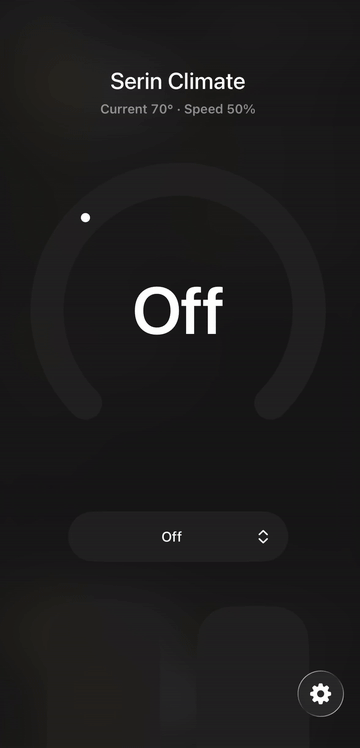
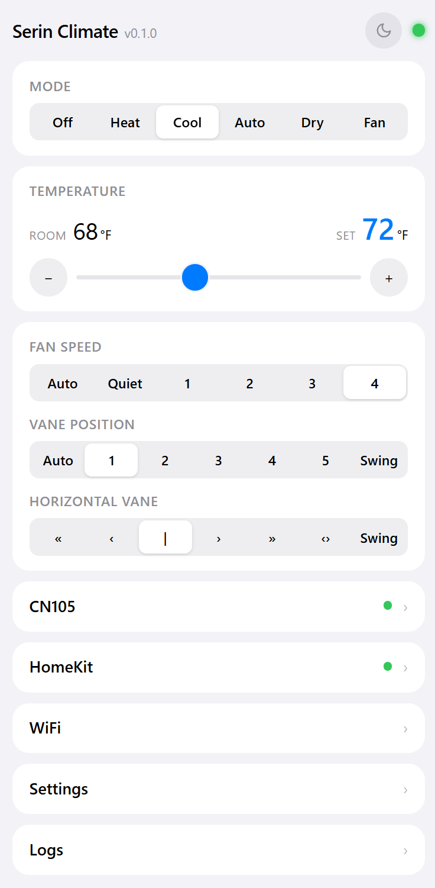
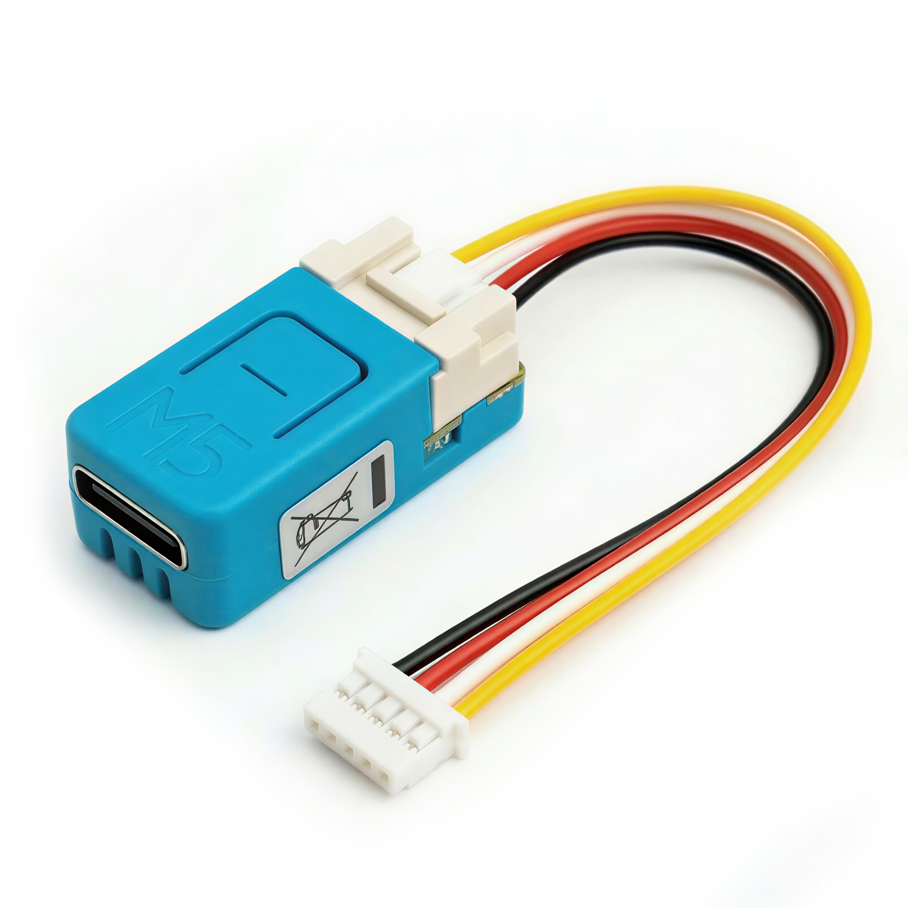
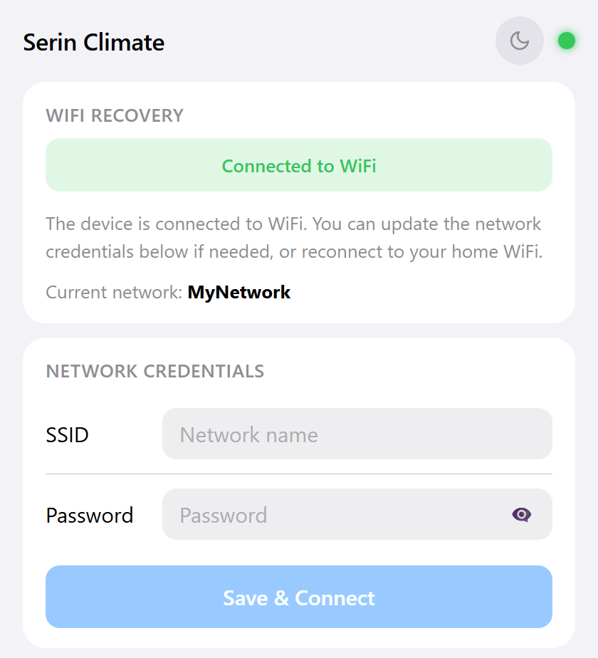
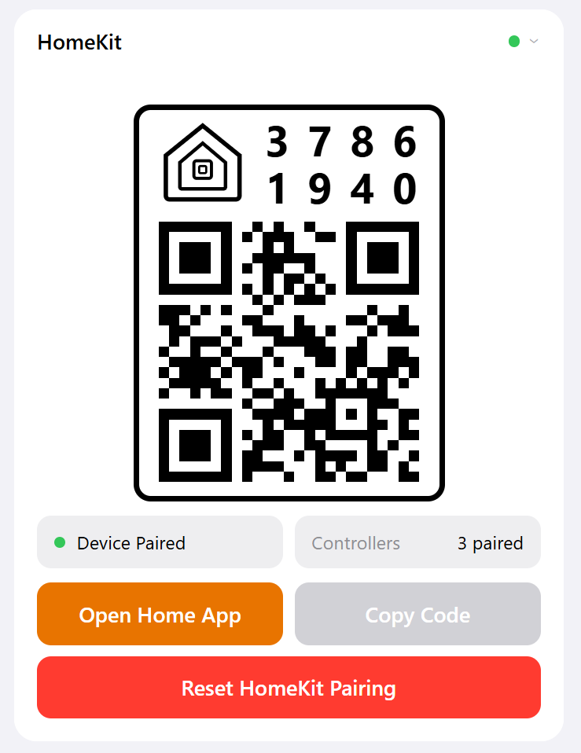

# Mitsubishi CN105 HomeKit Controller

Controls Mitsubishi mini split heat pumps via the CN105 serial connector, compatible with Apple Home through the HomeKit Accessory Protocol (HAP). No cloud, no bridge, no Home Assistant required.

<table>
  <tr>
    <td></td>
    <td></td>
  </tr>
  <tr>
    <td align="center"><em>HomeKit</em></td>
    <td align="center"><em>Web UI</em></td>
  </tr>
</table>

> [!CAUTION]
> **Use at your own risk.** This is an unofficial implementation based on the reverse-engineered CN105 serial protocol. It is not developed, endorsed, or supported by Mitsubishi Electric or Apple. Connecting third-party hardware to your heat pump may void its warranty. Not all units support every feature, and behavior may vary by model. The authors and contributors provide this software as-is, with no warranty or guarantee of any kind. 

## Requirements

### Hardware



| Component | Details |
|-----------|---------|
| **Microcontroller** | Any [supported board](#supported-boards) (default: M5Stack NanoC6) |
| **Connector** | Grove (HY2.0-4P) to CN105 cable (NanoC6) |
| **Heat pump** | Mitsubishi mini split with CN105 connector |

For a list of known-compatible models, see the [MitsubishiCN105ESPHome supported units list](https://github.com/echavet/MitsubishiCN105ESPHome?tab=readme-ov-file#supported-mitsubishi-climate-units). Not all units support every feature (e.g., outside temperature, half-degree precision, wide vane control) — behavior varies by model.

### Software

- [PlatformIO](https://platformio.org/) (build system)
- Python 3 (for HTML embedding script)

### Boards

| Board | PlatformIO env | Build command | Tested |
|-------|---------------|---------------|-------|
| M5Stack NanoC6 (ESP32-C6) | `nanoc6` | `pio run -e nanoc6` | ✅ |
| M5Stack AtomS3/AtomS3 Lite | `m5atoms3-lite` | `pio run -e m5atoms3-lite` | ✅ |
| Generic ESP32 DevKit v1 | `esp32-devkit` | `pio run -e esp32-devkit` | ❌ |
| ESP32-S3-DevKitC-1 | `esp32s3-devkit` | `pio run -e esp32s3-devkit` | ❌ |
| ESP32-C3 SuperMini / XIAO | `esp32c3-mini` | `pio run -e esp32c3-mini` | ❌ |

Board profiles define GPIO pins, LED, button, UART clock source, and debug output for each target. See `include/boards/` for details. To add support for a new board, create a board profile header or use inline build flag overrides. See the [Custom Board Guide](docs/custom-boards.md) for full instructions.

## Wiring

Connect the M5Stack NanoC6 to the CN105 connector on the indoor unit's control board using the Grove port:

```
CN105 Connector          M5Stack NanoC6 (Grove)
┌──────────────┐
│ Pin 1 — 12V  │         ┌──────────────────────┐
│ Pin 2 — GND ─┼─────────┼─ GND (Black)         │
│ Pin 3 — 5V  ─┼─────────┼─ 5V  (Red)           │
│ Pin 4 — TX  ─┼─────────┼─ GPIO2 / RX (White)  │
│ Pin 5 — RX  ─┼─────────┼─ GPIO1 / TX (Yellow) │
└──────────────┘         └──────────────────────┘
```

The CN105 connector is typically located on the right side of ductless indoor unit's control board behind the front panel. Power is provided by the unit through pins 2 and 3 — no separate power supply is needed. If your board doesn't have a Grove port, you can connect directly to the appropriate GPIO pins for RX/TX, GND, and 5V (see [board profiles](#supported-boards)).

## Setup

### 1. Build and Flash

Clone the repository and flash the firmware:

```bash
git clone https://github.com/akifbayram/mitsubishi-cn105-homekit.git
cd mitsubishi-cn105-homekit

# Build for default board (NanoC6)
pio run

# Or build for a specific board
pio run -e esp32-devkit

# Flash via USB
pio run -t upload --upload-port /dev/ttyACM0
```

### 2. WiFi Provisioning

On first boot, the device creates a WiFi access point:

1. Connect to the **Serin-XXXX** network (XXXX = last 4 hex digits of WiFi MAC, password: `serinlabs`)
2. A captive portal appears — enter your WiFi SSID and password
3. The device saves credentials to flash and reboots
4. A unique 8-digit HomeKit setup code is auto-generated on first boot



### 3. WiFi Recovery

If the device loses WiFi connectivity, it automatically enables a fallback AP (**Serin-XXXX**) after 5 minutes, running concurrently with station mode so it continues attempting to reconnect. Three recovery layers are available:

| Layer | Method | Details |
|-------|--------|---------|
| **Auto AP** | Automatic | Fallback AP activates after 5 min disconnect (2 min after a credential change). Disables automatically when WiFi reconnects. |
| **Recovery page** | Web browser | Connect to the AP and navigate to `192.168.4.1:8080` to enter new WiFi credentials. |
| **Button reset** | Physical | 10-second long-press on the board button (e.g., GPIO9 on NanoC6) erases stored WiFi credentials. Only available on boards with a button. |

### 4. HomeKit Pairing



Once connected to WiFi:

**Option A — Scan QR Code (recommended):**

1. Scan the QR code shown in the web UI at `http://<device-ip>:8080` (HomeKit panel)

**Option B — Manual setup code:**

1. Open the **Home** app on your iPhone or iPad
2. Tap **+** > **Add Accessory**
3. Select **Mitsubishi Mini Split** (or tap **More options…** if it doesn't appear)
4. Enter the setup code shown in the web UI (HomeKit panel > Setup Code)

## OTA Updates

Update firmware over the air without USB access:

**Via Web UI:**
Navigate to `http://<device-ip>:8080`, open Settings, and use the Firmware Update section. The browser computes a SHA256 checksum before uploading, and the device verifies integrity before applying.

**Via curl:**
```bash
pio run  # build firmware
curl --data-binary @.pio/build/nanoc6/firmware.bin \
     -H "Content-Type: application/octet-stream" \
     http://<device-ip>:8080/upload
```

**Rollback protection:** After an OTA update, the device validates that WiFi and CN105 UART communication are working before confirming the new firmware. If the device reboots before validation (crash, power loss), it automatically rolls back to the previous firmware.

## Web UI

Access the web interface at `http://<device-ip>:8080`.

The single-page interface provides:

- **Mode** — Off/Heat/Cool/Auto/Dry/Fan mode selector (power integrated as Off mode)
- **Temperature** — set target temperature with 0.5°C precision, +/− step buttons
- **Dual Setpoints** — independent heat/cool thresholds in Auto mode (persisted to flash)
- **Fan Speed** — Auto, Quiet, Speed 1–4
- **Vane Control** — vertical and wide vane positions, swing mode
- **Diagnostics** — compressor frequency, outside temp, runtime hours, error codes, sub mode/stage
- **HomeKit** — pairing status, controller count, setup code with copy button, QR code for pairing, reset pairing button
- **Settings** — device name, poll interval (ms), log level, °C/°F toggle
- **Logs** — real-time log streaming via WebSocket
- **OTA** — firmware upload with integrity verification (see [OTA Updates](#ota-updates))

## HomeKit Details

Covers thermostat mode mappings (Heat/Cool/Auto/Off), FAN & DRY mode switches, fan speed percentages, dual setpoint behavior, vane control, and diagnostics. See [HomeKit Details](docs/homekit.md).

## Project Structure

See [Project Structure](docs/project-structure.md) for the full source tree with descriptions of each file.

## CN105 Protocol

2400 baud, 8E1 serial protocol over the CN105 connector. See [Protocol Reference](docs/protocol.md) for packet format and polling cycle details, and the [muart-group wiki](https://muart-group.github.io/) for community protocol documentation.

## Acknowledgments

This project builds on the work of several open-source projects in the Mitsubishi heat pump community:

- **[HomeSpan](https://github.com/HomeSpan/HomeSpan)** — ESP32 HomeKit library
- **[SwiCago/HeatPump](https://github.com/SwiCago/HeatPump)** — the original CN105 protocol library and compatibility documentation
- **[esphome-mitsubishiheatpump](https://github.com/geoffdavis/esphome-mitsubishiheatpump)** — early ESPHome integration
- **[MitsubishiCN105ESPHome](https://github.com/echavet/MitsubishiCN105ESPHome)** — ESPHome component with comprehensive CN105 protocol implementation
- **[muart-group](https://muart-group.github.io/)** — community documentation and protocol research

## Trademarks

Apple, Apple Home, and HomeKit are trademarks of Apple Inc. Mitsubishi Electric is a trademark of Mitsubishi Electric Corporation. This project is not certified by, endorsed by, or affiliated with Apple Inc. or Mitsubishi Electric Corporation.

## License

MIT