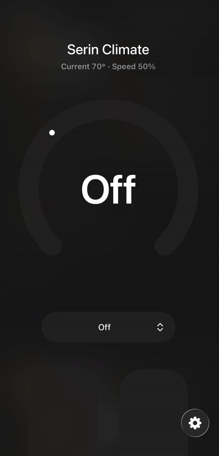
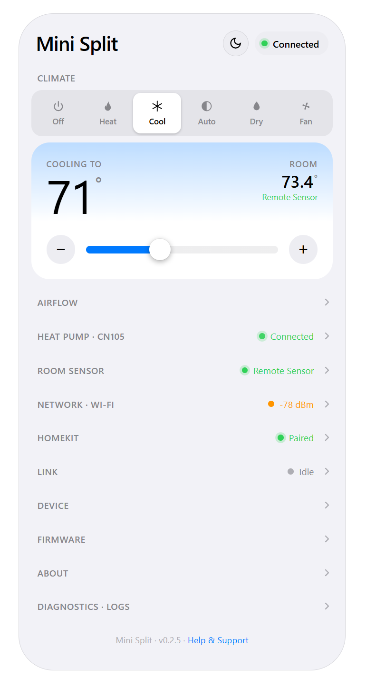
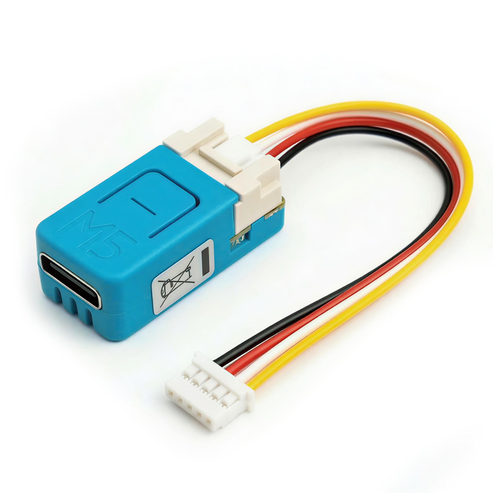
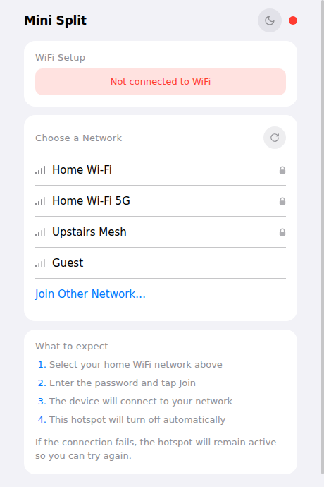
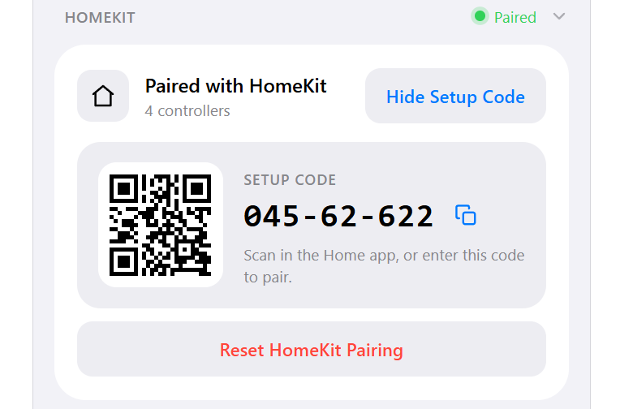
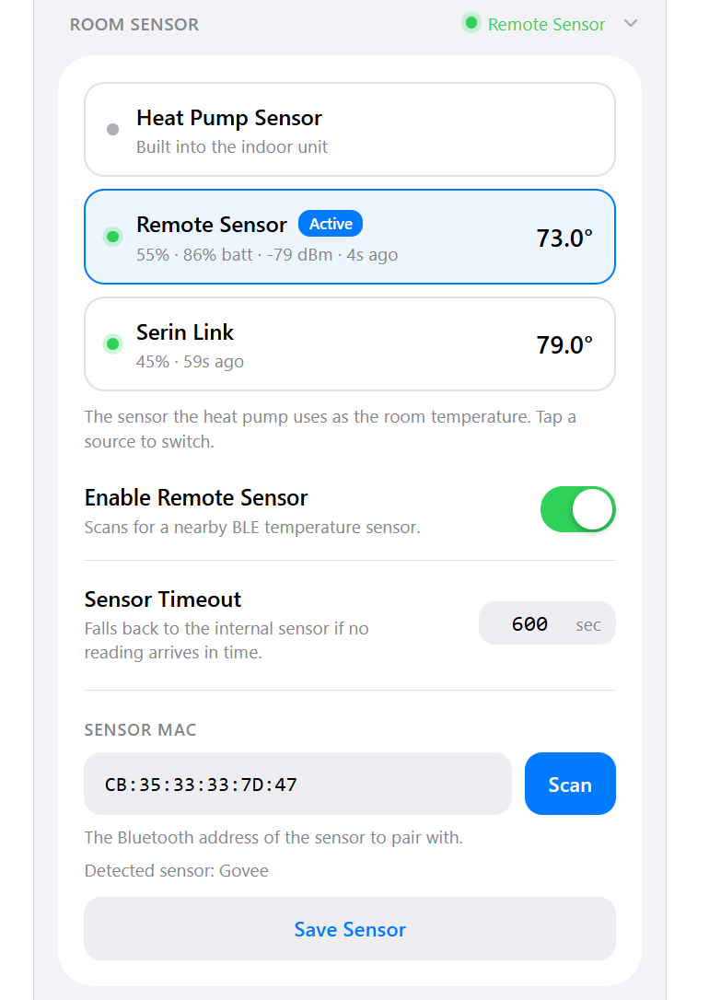
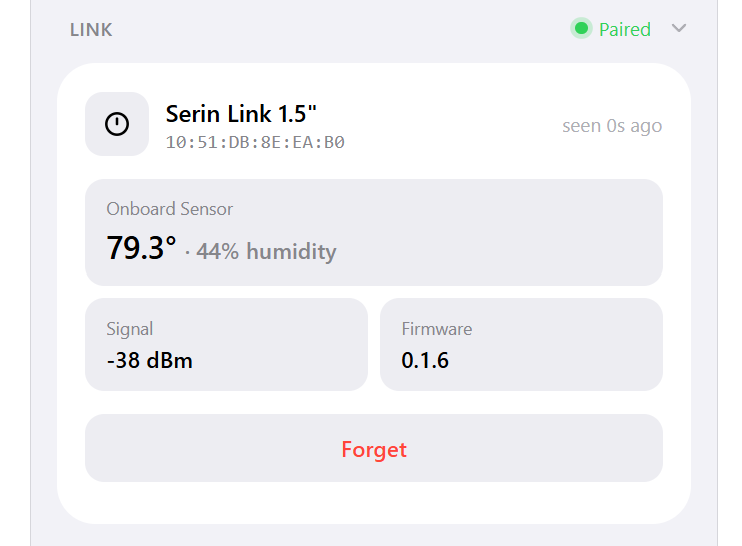
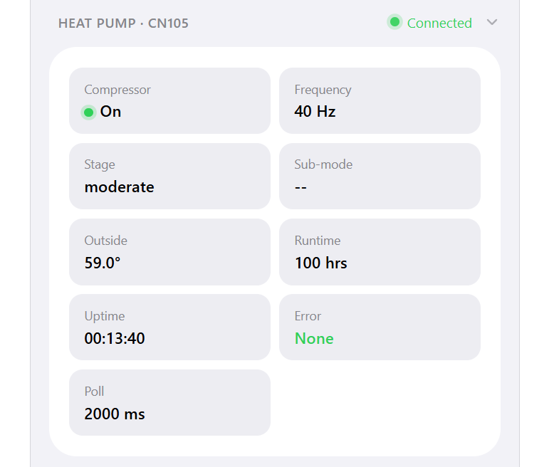

# Mitsubishi CN105 HomeKit Controller

Controls Mitsubishi mini split heat pumps via the CN105 serial connector, compatible with Apple Home through the HomeKit Accessory Protocol (HAP). No cloud, no bridge, no Home Assistant required.

<table>
  <tr>
    <td></td>
    <td></td>
  </tr>
  <tr>
    <td align="center"><em>HomeKit</em></td>
    <td align="center"><em>Web UI</em></td>
  </tr>
</table>

> [!CAUTION]
> **Use at your own risk.** This is an unofficial implementation based on the reverse-engineered CN105 serial protocol. It is not developed, endorsed, or supported by Mitsubishi Electric or Apple. Connecting third-party hardware to your heat pump may void its warranty. Not all units support every feature, and behavior may vary by model. The authors and contributors provide this software as-is, with no warranty or guarantee of any kind.

## Features

- **Native Apple HomeKit** — pairs directly with Apple Home; no cloud, bridge hardware, or Home Assistant required
- **Web UI** — real-time control, diagnostics, and log streaming
- **Browser-based flashing** — no development tools needed ([web flasher](https://serin-labs.com/flash))
- **Room temperature sources** — feed the heat pump its own sensor, one of up to four BLE thermometers, or a paired Serin Link, or average several of them
- **BLE remote temperature sensors** — Govee, Xiaomi (PVVX), SwitchBot, BTHome v2, with auto-detection and a per-sensor calibration offset
- **Serin Link** — optional physical dial with a display for control and live status over an encrypted wireless link
- **OTA firmware updates** — SHA256 verification, wrong-image rejection, and automatic rollback
- **Dual setpoint Auto mode** — independent heating and cooling thresholds
- **Multi-board support** — ESP32, ESP32-C3, ESP32-C6, ESP32-S3
- **WiFi recovery** — credentials trialled before they are saved, plus an automatic fallback AP
- **Crash-loop safe mode** — the device stays reachable for a firmware update even if it can't boot cleanly

## Quick Start

1. **Flash** — Open the [web flasher](https://serin-labs.com/flash), connect your board via USB, and flash the firmware from your browser
2. **Connect** — Join the **Serin-XXXX** WiFi network (password: `serinlabs`) and enter your WiFi credentials
3. **Pair** — Open Apple Home, scan the QR code from the web UI at `http://serin-xxxx.local` or `http://<device-ip>`

For developer setup with ESP-IDF, custom boards, and build-time options, see [Setup](#setup).

## Requirements

### Hardware

**Two ways to get it.** Serin Labs sells an assembled and tested [Serin Controller](https://serin-labs.com/controller) and [CN105 cable](https://serin-labs.com/cable) if you'd rather not source the parts yourself. Everything below is for building your own.



| Component | Details |
|-----------|---------|
| **Microcontroller** | Any [supported board](#boards) (default: M5Stack NanoC6) |
| **Connector** | Grove (HY2.0-4P) to CN105 cable (NanoC6) |
| **Heat pump** | Mitsubishi mini split with CN105 connector |

For a full parts list with purchase links, see the [parts guide](https://serin-labs.com/parts). For compatible models, see the [compatibility list](https://serin-labs.com/compatibility) or the [MitsubishiCN105ESPHome supported units list](https://github.com/echavet/MitsubishiCN105ESPHome?tab=readme-ov-file#supported-mitsubishi-climate-units). Not every unit supports every feature (outside temperature, half-degree precision, wide vane control); it varies by model. Modes your unit doesn't have can be hidden from both Apple Home and the web UI; see [Unit Capabilities](#web-ui).

### Software

- [ESP-IDF v5.5](https://docs.espressif.com/projects/esp-idf/en/v5.5/) (build framework)
- Python 3 (for HTML embedding script)

### Boards

| Board | Target | Profile flag | Prebuilt | Hardware-tested |
|-------|--------|--------------|:--------:|:---------------:|
| M5Stack NanoC6 (ESP32-C6) | `esp32c6` | `-DBOARD_PROFILE_NANOC6=1` (default) | ✅ | ✅ |
| M5Stack Atom S3 Lite (ESP32-S3) | `esp32s3` | `-DBOARD_PROFILE_M5ATOMS3_LITE=1` | ✅ | ✅ |

**Prebuilt** means the release CI publishes binaries for that board to the [web flasher](https://serin-labs.com/flash). **Hardware-tested** means it has been run against a real heat pump. Other profiles ship in `main/boards/` and build from source, but are unpublished and unverified — flash them with `idf.py flash`.

Build with the target and the profile flag together:

```bash
idf.py set-target esp32s3
idf.py -DBOARD_PROFILE_M5ATOMS3_LITE=1 build
```

Two profiles can share a chip target (Atom S3 Lite and S3 DevKitC-1 are both `esp32s3`), so the profile flag, not the target, is what picks the pinout. Omit it and you get that target's default profile.

Board profiles define GPIO pins, LED, button, UART clock source, and debug output for each target. See `main/boards/` for details, or the [Custom Board Guide](docs/custom-boards.md) to add a new board.

## Wiring

Connect the M5Stack NanoC6 to the CN105 connector on the indoor unit's control board using the Grove port. For detailed wiring photos and diagrams, see the [wiring guide](https://serin-labs.com/wiring).

```
CN105 Connector          M5Stack NanoC6 (Grove)
┌──────────────┐
│ Pin 1 — 12V  │         ┌──────────────────────┐
│ Pin 2 — GND ─┼─────────┼─ GND (Black)         │
│ Pin 3 — 5V  ─┼─────────┼─ 5V  (Red)           │
│ Pin 4 — TX  ─┼─────────┼─ GPIO2 / RX (White)  │
│ Pin 5 — RX  ─┼─────────┼─ GPIO1 / TX (Yellow) │
└──────────────┘         └──────────────────────┘
```

The CN105 connector is typically located on the right side of ductless indoor unit's control board behind the front panel. Power is provided by the unit through pins 2 and 3. If your board doesn't have a Grove port, you can connect directly to the appropriate GPIO pins for RX/TX, GND, and 5V (see [board profiles](#boards)).

## Setup

### 1. Flash Firmware

**Option A — Web Flasher (recommended):**

No tools to install. Visit the [web flasher](https://serin-labs.com/flash), connect your board via USB, select your board type, and click flash. Works in Chrome and Edge.

**Option B — ESP-IDF (developers):**

```bash
git clone --recursive https://github.com/akifbayram/mitsubishi-cn105-homekit.git
cd mitsubishi-cn105-homekit

# Activate ESP-IDF environment (idf.py is not on PATH until you do)
source ~/esp/esp-idf/export.sh

# Build for default board (NanoC6 / ESP32-C6)
idf.py set-target esp32c6
idf.py build

# Flash via USB
idf.py -p /dev/ttyACM0 flash

# Monitor serial output
idf.py -p /dev/ttyACM0 monitor
```

For any board other than the NanoC6, add its [profile flag](#boards) to the build command. `sdkconfig` is generated and gitignored. `set-target` rewrites it, so switching targets in an existing checkout is safe, but copying someone else's `sdkconfig` is not.

Host-side unit tests need no hardware and no ESP-IDF:

```bash
for t in test/*/run.sh; do bash "$t"; done
```

### 2. WiFi Provisioning

**Option A — Setup hotspot (default):**

1. Connect to the **Serin-XXXX** network (XXXX = last 4 hex digits of WiFi MAC, password: `serinlabs`)
2. A captive portal appears. Enter your WiFi SSID and password
3. The device tries the credentials before saving them. If they work it commits them and joins; if they don't, the hotspot stays up and the portal reports the failure
4. A unique 8-digit HomeKit setup code is auto-generated on first boot



**Option B — Improv Serial (over USB):**

While the device is unprovisioned, it speaks [Improv Serial](https://www.improv-wifi.com/serial/) on the USB console, so a browser can send credentials over the same cable used to flash it, with no hotspot step. The serial console REPL takes over once the device is on WiFi, so Improv is only available during setup.

**Option C — From a paired Serin Link:**

A paired dial can push new WiFi credentials to the unit over the encrypted ESP-NOW link, which recovers a unit that has fallen off the network without using the hotspot. See [Serin Link](#serin-link).

**Build-time WiFi (optional):** To skip provisioning entirely during development, pass WiFi credentials as CMake flags:

```bash
idf.py -DWIFI_SSID="MyNetwork" -DWIFI_PASSWORD="MyPassword" build
```

The device will connect automatically on boot. WiFi can still be changed later via the web UI.

**Finding the device:** once it joins your network the device advertises itself over mDNS as `serin-xxxx.local` (same suffix as the hotspot name), so you do not need to look up its IP address.

### 3. WiFi Recovery

If the device loses WiFi, it spins up a fallback AP (**Serin-XXXX**) after 5 minutes while still trying to reconnect in the background. Four recovery options:

| Layer | Method | Details |
|-------|--------|---------|
| **Auto AP** | Automatic | Fallback AP activates after 5 min disconnect (2 min after a credential change). Disables automatically when WiFi reconnects. |
| **Recovery page** | Web browser | Connect to the AP and navigate to `192.168.4.1` to enter new WiFi credentials. |
| **Forget WiFi** | Web UI | **Network · Wi-Fi** card → **Advanced** → *Forget Wi-Fi…* erases stored credentials and restarts into setup mode. HomeKit pairing, the paired Link, and every other setting are kept. Available on every board. |
| **Button reset** | Physical | 10-second long-press on the board button (GPIO9 on the NanoC6) erases stored WiFi credentials. The LED turns red at 7 seconds to warn you before the erase fires. Only available on boards with a button. |

Changing WiFi from the web UI never strands the device: new credentials are trialled on the live radio first and only written to flash once they connect. If they fail, the device falls back to the network it was already on, without a reboot.

### 4. HomeKit Pairing



Once connected to WiFi:

**Option A — Scan QR Code (recommended):**

1. Scan the QR code shown in the web UI at `http://serin-xxxx.local` (HomeKit card)

**Option B — Manual setup code:**

1. Open the **Home** app on your iPhone or iPad
2. Tap **+** > **Add Accessory**
3. Select **Mini Split XXXX** (or tap **More options…** if it doesn't appear)
4. Enter the setup code shown in the web UI (HomeKit card > Setup Code)

### 5. Status LEDs

On boards with an RGB LED. Color indicates the subsystem and motion indicates activity: a slow pulse means working or waiting, solid means a steady state or a fault, and a fast blink flags something that needs attention.

| LED | Meaning |
|-----|---------|
| Off | Normal operation, everything healthy |
| White solid | Booting (until the web UI is up) |
| White slow pulse | Firmware update in progress |
| White fast blink | Identify (locating this device) |
| Red solid | CN105 link to the heat pump lost |
| Red fast blink | Heat pump is reporting an error code |
| Blue slow pulse | Setup hotspot is open |
| Blue fast blink | Testing submitted WiFi credentials |
| Blue solid | WiFi lost (RGB-only boards, see below) |
| Green solid | Success: paired, or WiFi joined |
| Purple slow pulse | Serin Link pairing window is open |
| Orange fast blink | Serin Link forgotten |
| Yellow slow pulse | Safe mode (see [Safe Mode](#safe-mode)) |

While the button is held, the LED previews what releasing it will do:

| Hold time | LED | Release action |
|-----------|-----|----------------|
| 2–7 s | Purple solid | Open a Serin Link pairing window (or forget the paired Link) |
| 7–10 s | Red fast blink | Nothing; a deliberate dead zone between the two actions |
| 10 s+ | Red fast blink | Erase stored WiFi credentials |

The 7–10 second dead zone exists so that overshooting the pairing tier does not erase your WiFi. On boards with a button but no RGB LED, the tiers still apply, without the visual warning.

On the NanoC6, a separate blue LED tracks WiFi (on = disconnected, off = connected), so the RGB LED never uses blue for WiFi loss. Boards without that second LED show WiFi disconnect as solid blue on the RGB LED instead.

The priority order between these states is a pure, host-tested policy (`main/sled_policy.h`, tests in `test/sled_policy/`).

## Room Temperature

Wall-mounted mini split units measure temperature at ceiling height near the return air intake, which usually reads warmer than the living space. Feeding the heat pump a reading from lower in the room gives it something better to work with.

These sources can supply that reading, all managed from the **Room Sensor** card in the web UI:

| Source | Reading from | Requires |
|--------|--------------|----------|
| **Heat Pump Sensor** | The unit's own internal thermistor | Nothing; always available, and the fallback for every other source |
| **Remote Sensor** | A BLE thermometer placed in the room, up to 4 of them | A board with Bluetooth and at least one configured sensor |
| **Serin Link** | The temperature sensor inside a paired dial | A paired Serin Link whose hardware reports sensing capability |

Only sources the unit can actually serve are listed. The card runs in one of two modes:

- **Single** — one source feeds the heat pump. Tap a row to switch.
- **Average** — check any number of remote sources and the firmware feeds their equal-weight mean, with each sensor's offset applied before the average is taken.

Whichever mode is active, the resulting value is forwarded to the heat pump every 20 seconds. A source that goes quiet past the stale timeout (default 10 minutes, adjustable from 30 seconds to 1 hour) is dropped: in Average mode it leaves the blend until it returns, and when no remote source is left the heat pump goes back to its own thermistor. The selection is kept either way, so it recovers when readings resume.

The heat pump's own sensor is never blended with a live remote reading. The CN105 echoes back whatever value it is fed as the room temperature, so the thermistor is unobservable while an override is active; checking nothing simply leaves the unit on its own sensor.

### Remote Sensor (BLE)

The firmware listens for BLE advertisements from the configured sensors. No Bluetooth pairing needed, just power the sensor on. The first sensor in the list also shows up in Apple Home as its own accessory (separate from the climate tile) reporting temperature, humidity, and battery level. Home shows a low-battery warning when the cell drops to 20% or below.

#### Supported Sensors

The firmware auto-detects the sensor type from the BLE advertisement format.

| Protocol | Devices | Tested |
|----------|---------|:------:|
| Govee V3 | H5072, H5075 ✅ | ✅ |
| Govee V2 | H5074, H5051, H5052, H5071 | ✅ |
| Govee V1 | H5100, H5101, H5102, H5103, H5104, H5105, H5108, H5110, H5174, H5177, GV5179 | ✅ |
| PVVX | Xiaomi LYWSD03MMC, CGG1 (requires [PVVX custom firmware](https://github.com/pvvx/ATC_MiThermometer)) | ❌ |
| SwitchBot | Meter (W2300000), Meter Plus (W2301500), Meter Pro (W4900010) ✅, Meter Pro CO2 (W4900030), Indoor/Outdoor Meter (W3400010) | ✅ |
| BTHome v2 | Shelly BLU H&T, or any BTHome v2 device | ❌ |

#### Web UI Configuration



The **Room Sensor** card carries the BLE settings on boards with Bluetooth:

- **Single / Average** — pick between one feeding source and a blend of several
- **Headline** — what the heat pump currently sees, the sensors behind it, and why (equal average, one sensor, fallback, or a spread warning when the contributors disagree)
- **Source rows** — one row per available source, each showing its live reading, battery, signal, and how long ago it last reported. Tap to select in Single mode, check to include in Average mode.
- **Add Sensor…** — scan for nearby thermometers with their live temperature and humidity, or *Enter address manually…* to type a MAC. Up to 4 sensors; each can be renamed after the room it sits in, or removed.
- **Enable Remote Sensors** — turn BLE scanning on or off
- **Sensor Timeout** — how long a source may go quiet before it counts as stale (30–3600 s)
- **Manage Sensors** — rename or remove a sensor, and set a calibration offset per sensor (±9.9 °C, entered in the display unit), applied to each reading before it is used or averaged
- **Indicators** — green (healthy), orange (stale or no data yet), gray (not configured)

## Serin Link

Serin Link is an accessory physical dial with a display that mirrors the unit's live state and controls power, mode, setpoint, fan, and vanes over an encrypted wireless link. All HVAC logic stays on the unit, so the dial and Apple Home always report the same state.

The unit-side implementation lives in this repository; the dial's own firmware is distributed separately by Serin Labs. The hardware is still in development — see the [Serin Link page](https://serin-labs.com/link) for what it does and to be notified when it ships.



**Pairing.** Open a 60-second pairing window on the unit, using either the **Pair** button on the Link card or a 2–7 second hold of the unit's button, then start pairing from the dial. Pairing is Ed25519-signed trust-on-first-use, and one unit can hold up to **4** paired dials. *Forget* on the Link card clears a bond; so does the same 2–7 second button hold when a dial is already paired.

**What the link carries.** Beyond control, a paired dial can act as the [room temperature source](#room-temperature), forward humidity, report its own telemetry (model, firmware, signal, last seen) to the Link card, and push new WiFi credentials to the unit if it has fallen off the network. Replayed packets are rejected across a controller reboot, and modes your unit doesn't support are masked out on the dial the same way they are in Apple Home.

## Safe Mode

If the device reboots unexpectedly 5 times in a row, it comes up in safe mode: the CN105 link, HomeKit, and Bluetooth all stay shut down, and only WiFi and the web UI start. The status LED pulses yellow and the web UI shows a banner.

A device that cannot boot cleanly stays reachable for a firmware update instead of having to come off the wall. Update from the Firmware card, then restart. A clean boot clears the crash counter and returns to normal operation.

## OTA Updates

Update firmware over the air without USB access:

**Via Web UI:**
Open the web UI and use the **Firmware** card. The browser computes a SHA256 checksum before uploading, and the device verifies integrity before applying.

**Via curl:**
```bash
idf.py build
curl --data-binary @build/mitsubishi-cn105-homekit.bin \
     -H "Content-Type: application/octet-stream" \
     http://<device-ip>/upload
```

**Check for updates:** The **Firmware** card has a "Check for Updates" button. Your browser fetches the release manifest, compares it against the running version, and offers a one-click install when a newer build is available (the device itself does no GitHub I/O). This is hidden on custom and untracked builds.

**Wrong-image rejection:** The device inspects the ESP application header as the upload streams in and refuses firmware built for a different chip or a different application before writing any of it to flash. SHA256 only proves the file arrived intact, so an image built for the wrong device passes it. One gap remains: two board profiles that share a chip and a project name (Atom S3 Lite and S3 DevKitC-1) are indistinguishable at this layer, so still pick the right board in the flasher.

**Rollback protection:** After an OTA update, the device checks that WiFi and CN105 UART still work before confirming the new firmware. If it reboots before that check passes (crash, power loss), the bootloader rolls back to the previous firmware. The rollback decision is made by the bootloader, which OTA cannot update, so units flashed before this feature was enabled need one USB flash to pick it up.

## Web UI

Access the web interface at `http://serin-xxxx.local` or `http://<device-ip>`. It is a single self-contained page served from the device and needs no internet access. It follows your system's light or dark appearance and has a manual toggle.

The page is organised into cards:

- **Climate** — Off/Heat/Cool/Auto/Dry/Fan selector (power is integrated as Off), target temperature at 0.5°C precision, and in Auto a dual-setpoint range slider for independent heat/cool thresholds
- **Airflow** — fan speed (Auto, Quiet, Low, Med, High, Max), vertical vane, horizontal vane, swing
- **Heat Pump · CN105** — link status plus compressor frequency, outside temp, runtime hours, error codes, and sub mode/stage
- **Room Sensor** — single or averaged room temperature sources, BLE sensor list, readings, offsets, stale timeout (see [Room Temperature](#room-temperature))
- **Network · Wi-Fi** — current network and uptime, a scan list of nearby networks, credential entry with trial-before-save, and *Forget Wi-Fi…* under **Advanced**
- **HomeKit** — pairing status, controller count, setup code with copy button, QR code, and reset pairing
- **Link** — paired dial model, firmware, signal, last seen; pair, cancel, and forget (see [Serin Link](#serin-link))
- **Device** — device name, °C/°F, vane type, Unit Capabilities (which HVAC modes your unit actually has), log level, poll interval, settings export/import, and factory reset behind an **Advanced** disclosure
- **Firmware** — installed version, Check for Updates, manual `.bin` upload, **Flash LED** to identify the device, and Restart (see [OTA Updates](#ota-updates))
- **About** — board, firmware, IP, mDNS name, MAC, last reset reason, boot and crash counts, free and lowest-ever heap, WiFi and heat-pump drop counters, a persistent device event log, one-tap **Copy Diagnostics** for support, and the safe-mode banner
- **Diagnostics · Logs** — real-time log streaming over WebSocket



*The **Heat Pump · CN105** card, expanded.*

Under **Unit Capabilities**, unchecking a mode your unit doesn't have hides it here, in Apple Home, and on a paired Link. Because that changes the HomeKit accessory shape, the UI prompts for a restart afterward.

## HomeKit Details

The device pairs as a HomeKit bridge. The thermostat appears as one accessory behind it, and the first configured BLE sensor as a second, distinct accessory (the sensor accessory predates the multi-sensor list and still tracks slot 0 only). Every service reports a connection state, so the Home app marks an accessory "Not Responding" when the CN105 link or BLE sensor drops. Which services are published depends on [Unit Capabilities](#web-ui); a cooling-only unit exposes no Heat mode and no Dry switch.

Triggering **Identify** from the Home app flashes the status LED white, which is the quickest way to tell two units apart. The web UI's **Flash LED** button and `POST /identify` do the same thing.

Thermostat mode mappings, FAN/DRY mode switches, fan speed percentages, dual setpoints, vane control, and diagnostics are documented in [HomeKit Details](docs/homekit.md). For an overview of HomeKit features and setup, see the [Serin Labs HomeKit page](https://serin-labs.com/homekit/features).

## CN105 Protocol

2400 baud, 8E1 serial protocol over the CN105 connector. See [Protocol Reference](docs/protocol.md) for packet format and polling cycle details, and the [muart-group wiki](https://muart-group.github.io/) for community protocol documentation.

## Troubleshooting

See the [troubleshooting guide](https://serin-labs.com/troubleshooting) for help with flashing, WiFi, HomeKit pairing, and CN105 connection issues. The **Copy Diagnostics** button on the About card gathers device identity, health counters, and recent events in one paste-able block. Include it when reporting a problem.

## Acknowledgments

Built on work from:

- **[esp-homekit-sdk](https://github.com/espressif/esp-homekit-sdk)** — Espressif's official HomeKit SDK for ESP-IDF
- **[SwiCago/HeatPump](https://github.com/SwiCago/HeatPump)** — the original CN105 protocol library and compatibility documentation
- **[esphome-mitsubishiheatpump](https://github.com/geoffdavis/esphome-mitsubishiheatpump)** — early ESPHome integration
- **[MitsubishiCN105ESPHome](https://github.com/echavet/MitsubishiCN105ESPHome)** — ESPHome component with comprehensive CN105 protocol implementation
- **[muart-group](https://muart-group.github.io/)** — community documentation and protocol research

## Trademarks

Apple, Apple Home, and HomeKit are trademarks of Apple Inc. Mitsubishi Electric is a trademark of Mitsubishi Electric Corporation. This project is not certified by, endorsed by, or affiliated with Apple Inc. or Mitsubishi Electric Corporation.

## License

MIT